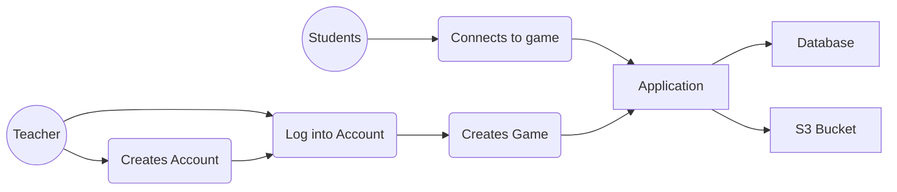

```mermaid
flowchart LR
    A((Students)) --> D(Connects to game) --> E[Application]
    C(Creates Game) --> E
    B((Teacher)) --> I(Creates Account)
    B --> J(Log into Account)
    I --> J
    J --> C
    E --> DB[Database]
    E --> S3[S3 Bucket]

```

Soft-edge boxes are actions. Circles are clients. Hard rectangles are applications. This is still in the perspective of the outside user.
