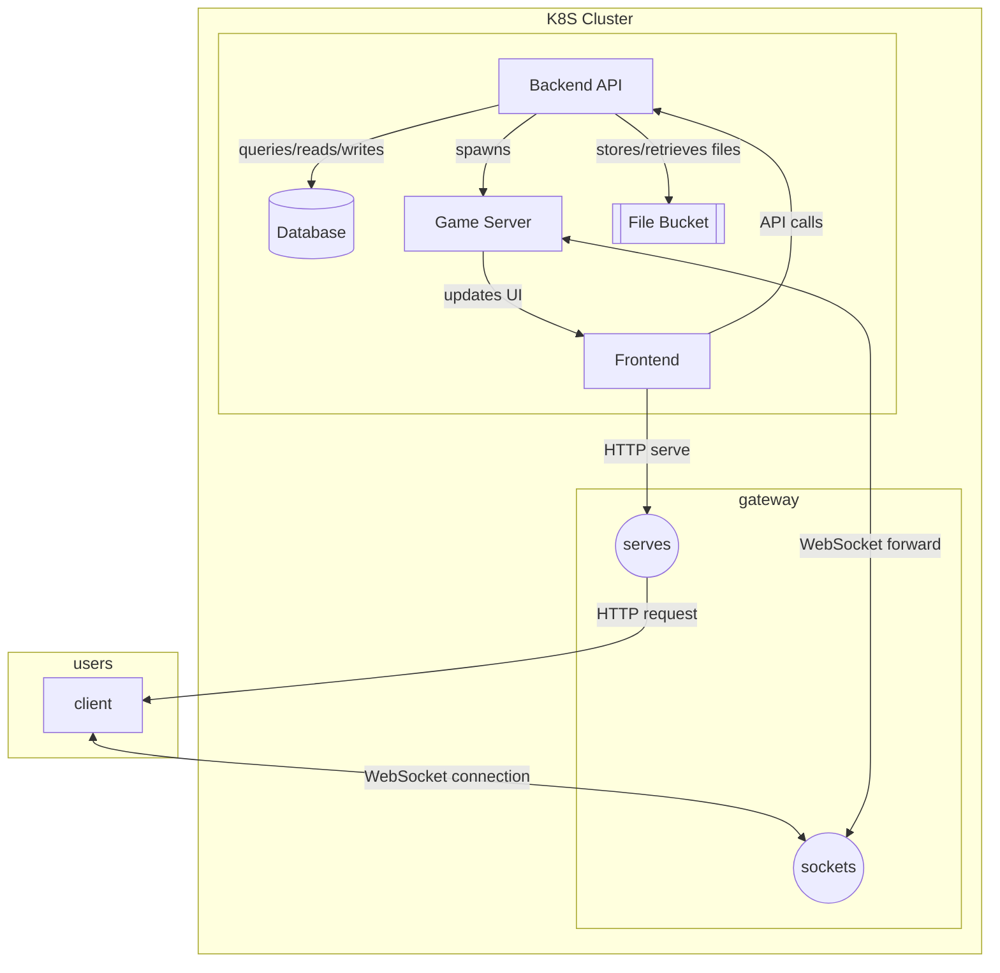

Arrows are labelled indicating the action being take. Circles represent the different application layer protocols that will be used to serve the game and sync the game with the server. Hard rectangles are machines that are involved in starting or participating in the game loop. The cylinder and double rectangle represent the database and object store respectively. Note that the entire section listed under the k8s cluster and gateway are expected to scale and load balance in a production deployment.
