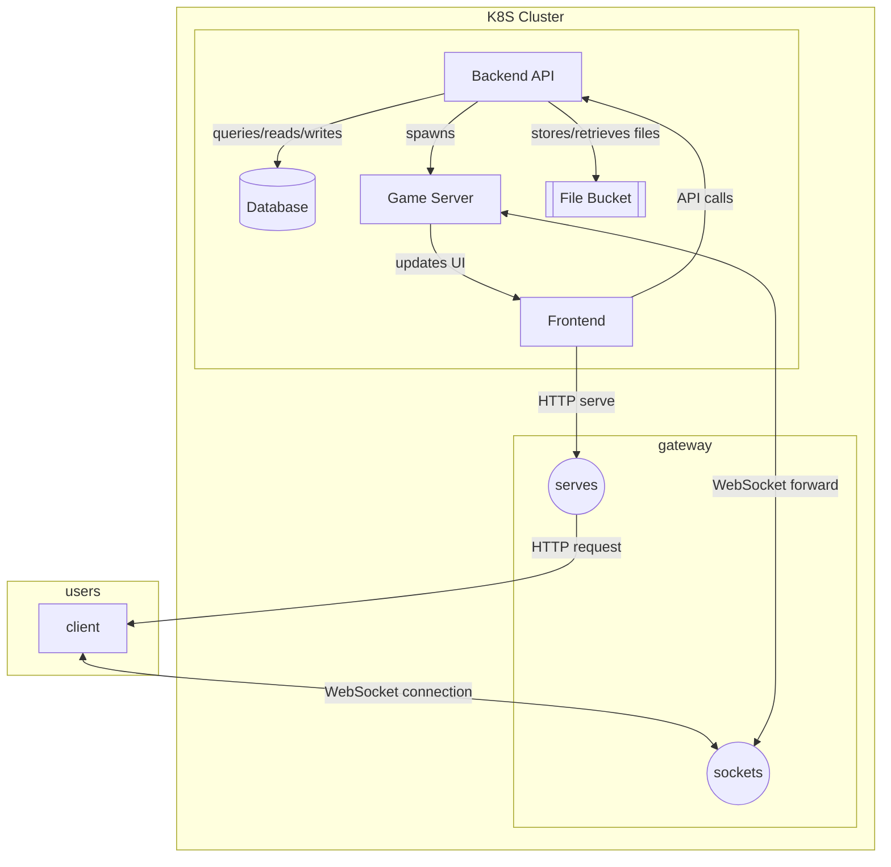

```mermaid
flowchart TD
    subgraph K8S_Cluster["K8S Cluster"]
        direction TB

        subgraph API_Services[" "]
            DB[(Database)]
            SERVER[Backend API]
            FRONTEND[Frontend]
            GAMESERVER[Game Server]
            BUCKET[[File Bucket]]
        end

        subgraph Gateway["gateway"]
            SOCKETS((sockets))
            SERVES((serves))
        end
    end

    subgraph Users["users"]
        CLIENT[client]
    end

    SERVER -->|spawns| GAMESERVER
    GAMESERVER -->|updates UI| FRONTEND
    SERVER -->|queries/reads/writes| DB
    FRONTEND -->|API calls| SERVER
    SERVER -->|stores/retrieves files| BUCKET

    SOCKETS <-->|WebSocket forward| GAMESERVER
    FRONTEND -->|HTTP serve| SERVES

    CLIENT <-->|WebSocket connection| SOCKETS
    SERVES -->|HTTP request| CLIENT
```

