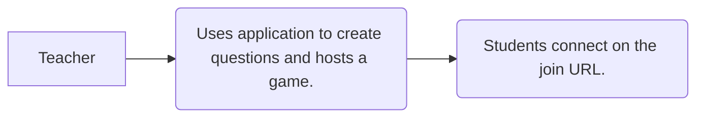

```mermaid
flowchart LR
    Teacher --> A(Uses application to create questions and hosts a game.)
    A --> B(Students connect on the join URL.)

```

Boxes indicate steps for usage as an outside user. The arrows indicate the order of the steps the user would take to play this game.
