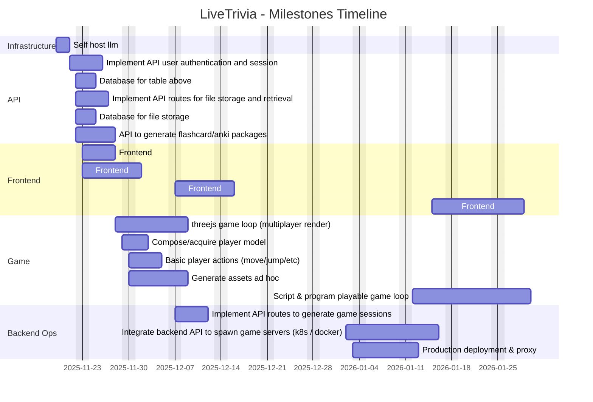

# Milestones
Since I wrote the tasklisk I have decided to not host grok.

1. Self host llm - **19/11/2025**
2. Implement API user authenication and session - **21/11/2025**
3. Database for table above - **22/11/2025**
4. Implement API routes for file storage and retrieval. - **22/11/2025**
5. Database for table above - **22/11/2025**
6. Implement API routes to generate flash card questions to anki packages. - **22/11/2025**
7. Develop frontend to implement the user session from task 2. - **23/11/2025**
8. Develop frontend to complete the actions from tasks 4 and 6. - **23/11/2025**
9. Develop threejs game loop to live render multiple players. - **28/11/2025**
10. Compose or acquire player model. - **29/11/2025**
11. Develop basic player actions, move, jump, ect. - **30/11/2025**
12. Generate assets ad hoc to create first game. - **30/11/2025**
13. Script and program game loop so the game is playable. - **12/1/2026**
14. Implement API routes to generate game sessions. - **7/12/2025**
15. Develop frontend to create and join game sessions. - **7/12/2025**
16. Develop and integrate frontend to serve the game client embedded in the frontend. - **15/1/2026**
17. Integrate backend API to spawn game servers - **1/2/2026**
    - kubernetes(helm)
    - docker(dind)
18. Figure out production deployment and proxy. - **1/3/2026**

# Tables

### Timeline

### Effort Matrix

| Number | Task | Effort | Assignee |
|-------:|------|:------:|:--------|
| 1 | Self host llm | High | Hayden |
| 2 | Implement API user authentication and session | Medium | Hayden |
| 3 | Database for table above | Medium | Hayden |
| 4 | Implement API routes for file storage and retrieval | Medium | Hayden |
| 5 | Database for file storage | Medium | Hayden |
| 6 | Implement API routes to generate flash card questions to anki packages | Medium | Hayden |
| 7 | Develop frontend to implement the user session from task 2 | Low | Hayden |
| 8 | Develop frontend to complete the actions from tasks 4 and 6 | Low | Hayden |
| 9 | Develop threejs game loop to live render multiple players | High | Hayden |
| 10 | Compose or acquire player model | Low | Hayden |
| 11 | Develop basic player actions (move, jump, etc.) | Medium | Hayden |
| 12 | Generate assets ad hoc to create first game | Medium | Hayden |
| 13 | Script and program game loop so the game is playable | High | Hayden |
| 14 | Implement API routes to generate game sessions | Medium | Hayden |
| 15 | Develop frontend to create and join game sessions | Low | Hayden |
| 16 | Develop and integrate frontend to serve the game client embedded | Medium | Hayden |
| 17 | Integrate backend API to spawn game servers (kubernetes / docker) | High | Hayden |
| 18 | Figure out production deployment and proxy | High | Hayden |
